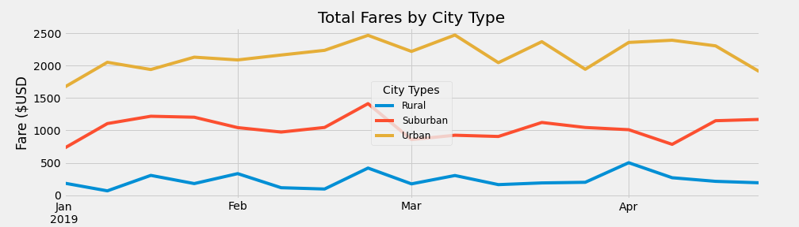

# PyBer_Analysis

KPI's or performance metrics are vital in determining the success of a business. An important metric for PyBer should be how well the company is performing in each of the three city types they service (rural, suburban, and urban). To gain insight we can look at the raw data from each city type to sort cities into rural/urban/suburban cities and pin the amount of PyBer drivers to each city. This data can then be aggregated with the raw driving data from each transaction and then sorted further using Pandas dataframes. 

| type     |   Total Rides |   Total Drivers | Total Fares   | Average Fare per Ride   | Average Fare per Driver   |
|:---------|--------------:|----------------:|:--------------|:------------------------|:--------------------------|
| Rural    |           125 |              78 | $4,327.93     | $34.62                  | $55.49                    |
| Suburban |           625 |             490 | $19,356.33    | $30.97                  | $39.50                    |
| Urban    |          1625 |            2405 | $39,854.38    | $24.53                  | $16.57                    |

Looking at the data it appears that drivers who service the rural locations earn 3.5 times what drivers in urban areas earn. Also if we compare suburban drivers to urban drivers, suburban driers make around 2.5 times what urban drivers make. Furthermore looking at total fares by city type, Pyber does more business in urban areas followed by suburban and rural areas respectively. With the volume of business being so high in urban areas along with the higher number of drivers, that could account for why drivers earn less in urban areas compared to rural and suburban areas.  

Because we are keeping track of the number of drivers for each city in the same dataframe as all our other PyBer data, I had to first get the total number of drivers per city type from our original dataframe that just had cities, number of drivers and city type. Once I had the total number of drivers per city then I had to go back to the PyBer dataframe that had all the aggregate data to find the average fare of each driver by taking the total number of drivers I had from the first step and dividing by the sum of all fares per city type. It wasn't too difficult but care must be taken when working across multiple datasets. 

Further analysis could be done on datasets that had the total drive time per trip or the total number of miles to see if density plays a part in the price per trip. For example, there is a higher volume of trips in urban areas but that may be just due to shorter trips vs the number of people in an area. Also we don't know if the reason that there are less rural trips is because the distances might be further spread out vs the number of people in rural areas.

